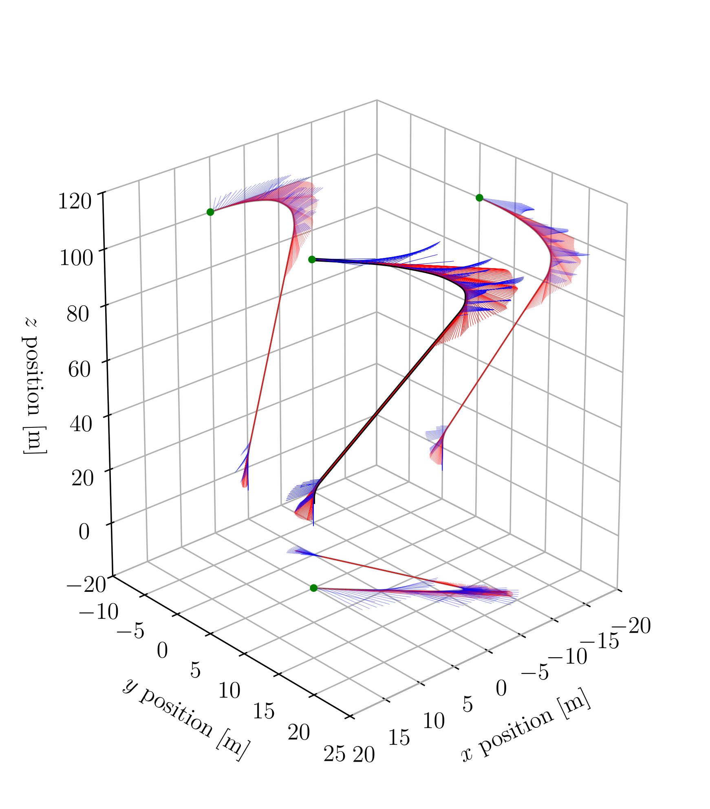

# Lossless convexification with a mixed-integer constraint



## General Description

This repository implements the numerical example of the paper cited below,
submitted to [Automatica](https://www.journals.elsevier.com/automatica/). This
solves the problem of satellite docking to a rotating space station. The
satellite is equipped with 12 thrusters of which at most 4 can be simutaneously
active, and each of which has an upper and lower bound 2-norm constraint.

``` 
@article{Malyuta2019e,
       author = {{Malyuta}, Danylo and {Szmuk}, Michael and {A\c{c}{\i}kme\c{s}e}, Beh\c{c}et},
        title = "Lossless Convexification for Optimal Control Problems with Multiple Inputs and a Control Exclusivity Constraint",
      journal = {arXiv e-prints},
     keywords = {Mathematics - Optimization and Control},
         year = "2019",
        month = "Feb",
          eid = {arXiv:1902.02726},
        pages = {arXiv:1902.02726},
archivePrefix = {arXiv},
       eprint = {1902.02726},
 primaryClass = {math.OC},
       adsurl = {https://ui.adsabs.harvard.edu/\#abs/2019arXiv190202726M},
      adsnote = {Provided by the SAO/NASA Astrophysics Data System}
}
```

## Requirements

To run the code, you must have Python 2.7.15 and [Gurobi
8.1](http://www.gurobi.com/downloads/download-center) installed. To install
Python and other dependenies (except Gurobi) on Ubuntu, we recommend that you
install [Anaconda for Python 2.7](https://www.anaconda.com/distribution/) and
then execute (from inside this repository's directory):

```
$ conda create -n lcvx_aut19 python=2.7 anaconda # Answer yes to everything
$ source activate lcvx_aut19
$ pip install -r requirements.txt
```

## Instructions

Execute ``main.py`` to run the code. If you followed the above installation
instructions, you can do:

```
$ source activate lcvx_aut19
$ ipython main.py
```

